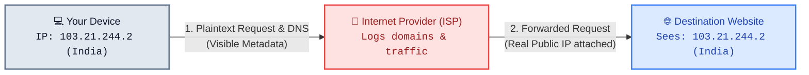
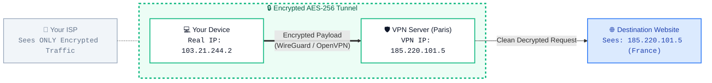
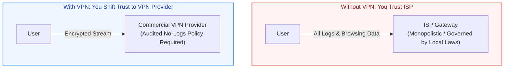
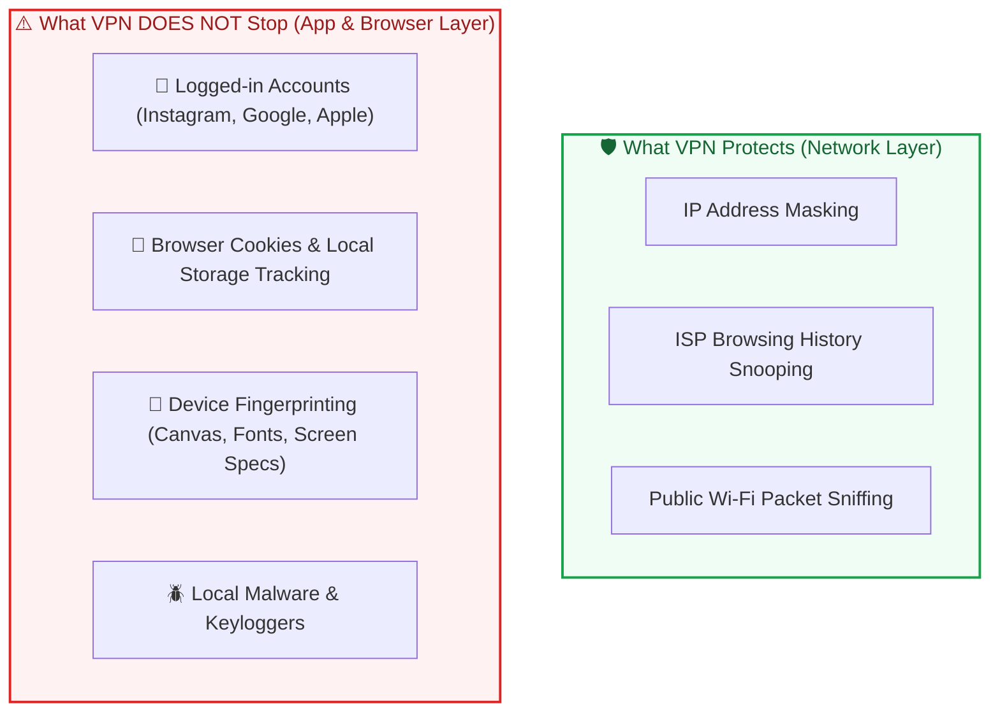
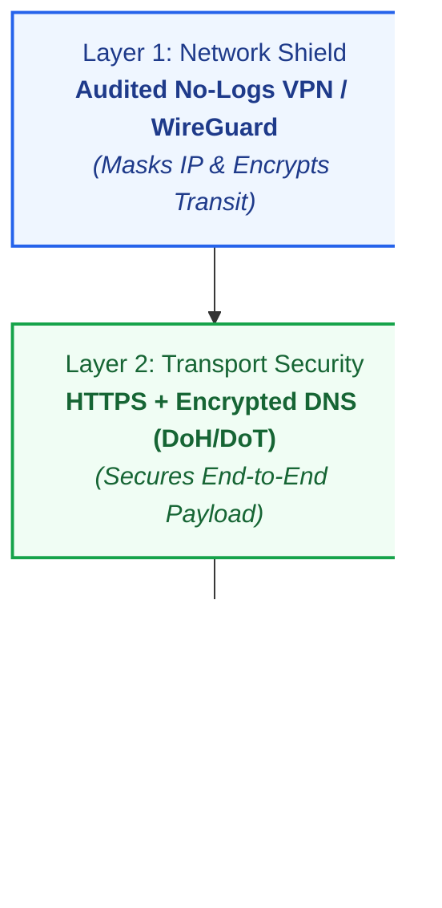

# 🔒 How a VPN Actually Works (Complete Architecture & Security Guide)

Hey! Thanks for commenting **"VPN"** on my video. Here is the full breakdown, technical flow, security cheat-sheet, and architecture diagrams explaining how VPNs work under the hood.

---

## 📌 1. Normal Internet Traffic (Without a VPN)

### What Happens Here:
- **Your ISP**: Acts as the gateway for every packet. It records every domain query (`instagram.com`, `bank.com`), builds advertising profiles, and can throttle connections.
- **Destination Website**: Sees your **real residential IP address** and pinpoints your physical city and country.

---

## 🛡️ 2. VPN Internet Traffic (With a VPN Active)

### What Happens Here:
1. **Encrypted Tunnel**: Traffic is encrypted locally on your device before transmission.
2. **ISP Blocked**: Your ISP sees only random bytes heading to one single destination (the VPN server).
3. **IP Masking & Virtual Geolocation**: The website only sees the VPN server's IP address and location (e.g., Paris, France).

---

## ⚠️ 3. The "Trust Shift" Concept

> **Key Rule**: A VPN doesn't eliminate trust; it shifts trust from your local ISP to your chosen VPN provider.

---

## 🔍 4. Why A VPN Is NOT 100% Anonymity (Network vs Application Layer)

---

## 📊 5. Summary Matrix: HTTPS vs. VPN

| Feature | HTTPS (SSL/TLS) | VPN (Virtual Private Network) |
|---|:---:|:---:|
| **Encrypts website payload (passwords, banking)** | ✅ Yes | ✅ Yes |
| **Hides visited domain from ISP** | ❌ No (ISP sees domain via SNI/DNS) | ✅ Yes (ISP only sees VPN server IP) |
| **Hides your real IP address from websites** | ❌ No | ✅ Yes |
| **Protects all background apps on device** | ❌ Only HTTPS web apps | ✅ Yes (system-wide) |
| **Protects against public Wi-Fi eavesdropping** | ⚠️ Partial (Metadata visible) | ✅ Full (All traffic enclosed in tunnel) |

---

## 💡 6. The Complete 3-Layer Privacy Stack

