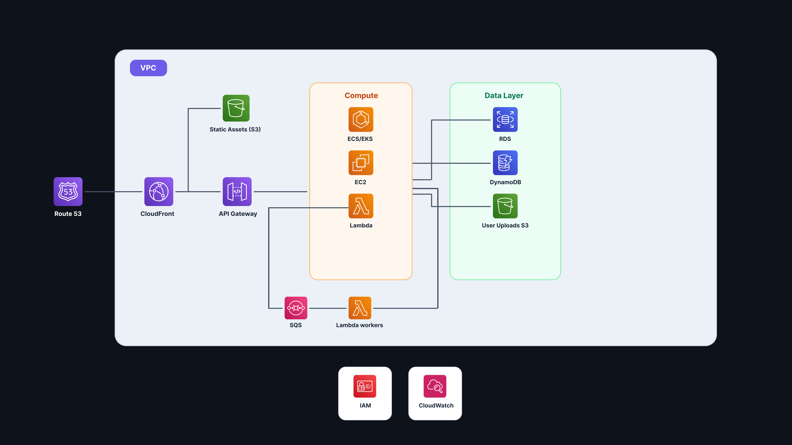

# ☁️ The Complete AWS Production Architecture Guide (End-to-End)

> **Thanks for commenting!** Here is the complete breakdown and architecture blueprint of a modern, scalable, production-ready AWS cloud architecture.

---

## 🗺️ Architecture Overview Diagram



---

## ⚡ The 60-Second Architecture Walkthrough

When a user visits and interacts with your application, traffic flows seamlessly through 8 core architectural tiers:

```
[ User Request ]
       │
       ▼
1. Route 53 (DNS & Global Traffic Routing)
       │
       ▼
2. CloudFront CDN ──► S3 Static Assets (HTML, CSS, JS)
       │ (Dynamic API Calls)
       ▼
3. API Gateway (Auth, Rate Limiting, CORS, SSL)
       │
       ▼
4. Compute Layer ───► [ Lambda (Serverless) | EC2 (VMs) | ECS / EKS (Containers) ]
       │
       ├─────────────────────────┬─────────────────────────┐
       ▼                         ▼                         ▼
5. Database Layer        6. Object Storage         7. Async Queue Tier
   • RDS (PostgreSQL/MySQL) • S3 (Media/Uploads)      • SQS (Message Queue)
   • DynamoDB (NoSQL)        └─► Cached via CDN        └─► Lambda Workers
                                                              │
                                                              ▼
8. Observability & Security ──────────────────────────► [ CloudWatch + IAM ]
```

---

## 🔍 Deep-Dive: Core Services Breakdown

### 1. DNS & Traffic Routing — Amazon Route 53
* **What it does**: Highly available and scalable cloud Domain Name System (DNS) web service.
* **Role**: Translates human-friendly domain names (`example.com`) into numeric IP addresses or CloudFront distribution endpoints using alias records.
* **Key Features**: Global latency-based routing, health checks, automated DNS failover, geo-DNS.

### 2. Edge Content Delivery & Static Hosting — Amazon CloudFront + S3
* **Amazon CloudFront**: Global Content Delivery Network (CDN) with 600+ edge locations caching content closest to users for sub-millisecond response times.
* **Amazon S3 (Static Hosting)**: Stores compiled front-end client bundles (React/Vue/Next static export, HTML, CSS, JavaScript, fonts).
* **Security**: Uses **Origin Access Control (OAC)** so the S3 bucket is 100% private and accessible strictly through CloudFront HTTPS.

### 3. API Gateway — Amazon API Gateway
* **What it does**: Managed ingress layer that publishes, maintains, monitors, and secures REST and WebSocket APIs at any scale.
* **Key Responsibilities**:
  * **Authentication & Authorization**: Integrated with AWS Cognito, OAuth2, or custom Lambda Authorizers.
  * **Traffic Management**: Built-in rate limiting, throttling, and DDoS mitigation.
  * **CORS & SSL Termination**: Handles TLS/SSL certificates and cross-origin policies automatically.

### 4. Compute Layer — Choose Your Model
| Compute Type | AWS Service | Ideal Use Case |
| :--- | :--- | :--- |
| **Serverless Functions** | **AWS Lambda** | Event-driven workloads, REST APIs, microservices, zero idle costs. |
| **Virtual Machines (VMs)** | **Amazon EC2** | Legacy applications, long-running processes, custom OS kernels. |
| **Containerized Services** | **Amazon ECS & EKS** | Dockerized microservices, high-throughput micro-architectures, Kubernetes ecosystems. |

### 5. Database Layer — Relational vs. NoSQL
* **Amazon RDS (Relational Database Service)**:
  * **Engines**: PostgreSQL, MySQL, MariaDB, Oracle, SQL Server, and Amazon Aurora.
  * **When to use**: Structured data, complex multi-table joins, ACID transactions, financial / relational records.
* **Amazon DynamoDB (Serverless NoSQL)**:
  * **When to use**: Key-value or document data requiring predictable single-digit millisecond latency at any scale, session stores, real-time gaming leaderboards, shopping carts.

### 6. Media & Object Storage — Amazon S3 (User Uploads)
* **What it does**: Industry-leading scalability, data availability, security, and performance object storage.
* **Workflow**: Direct user uploads via secure S3 Pre-Signed URLs (bypassing backend server bottleneck) with subsequent distribution back through CloudFront CDN.

### 7. Asynchronous Processing & Background Tasks — Amazon SQS + Lambda
* **Amazon SQS (Simple Queue Service)**: Fully managed message queuing service for decoupling microservices, distributed systems, and serverless applications.
* **Lambda Workers**: Auto-scaling worker functions that consume messages from SQS batches to process emails, resize media, trigger webhooks, or run background analytics.
* **Benefits**: Prevents web request timeouts, absorbs sudden traffic spikes, guarantees at-least-once message delivery.

### 8. Observability, Governance & Security
* **Amazon CloudWatch**: Unified monitoring, logging, metrics collection, automated alarms, and dashboards across every AWS component.
* **AWS IAM (Identity and Access Management)**: Enforces least-privilege security policies, role-based access control (RBAC), and service-to-service authentication without hardcoded API keys.

---

## 📊 Architecture Decision Matrix

| Requirement | Recommended Stack |
| :--- | :--- |
| **Rapid MVP / Startup** | CloudFront + S3 + API Gateway + Lambda + DynamoDB *(Zero idle cost)* |
| **Enterprise Relational App** | CloudFront + S3 + ALB + ECS (Fargate) + Amazon Aurora PostgreSQL |
| **High-Volume Event Processing** | API Gateway + SQS FIFO + Lambda Workers + DynamoDB |

---

## 🚀 Pro Tips for Production Deployment

1. **Infrastructure as Code (IaC)**: Deploy this entire blueprint using **AWS CDK**, **Terraform**, or **AWS SAM** for repeatable, version-controlled environments.
2. **Cost Optimization**: Enable S3 Intelligent-Tiering and CloudFront caching headers (`stale-while-revalidate`) to cut bandwidth costs by up to 70%.
3. **Security First**: Never store AWS credentials in code — always use **IAM Roles** and **AWS Secrets Manager**.

---

*Saved as part of your architecture toolkit. Feel free to reach out with any questions!*
