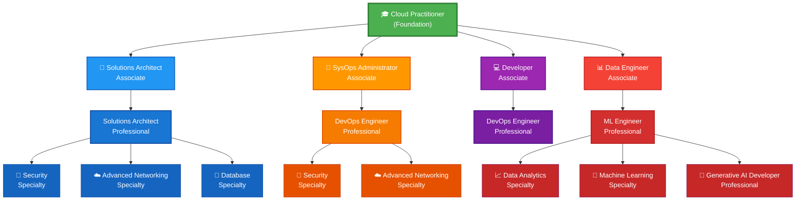
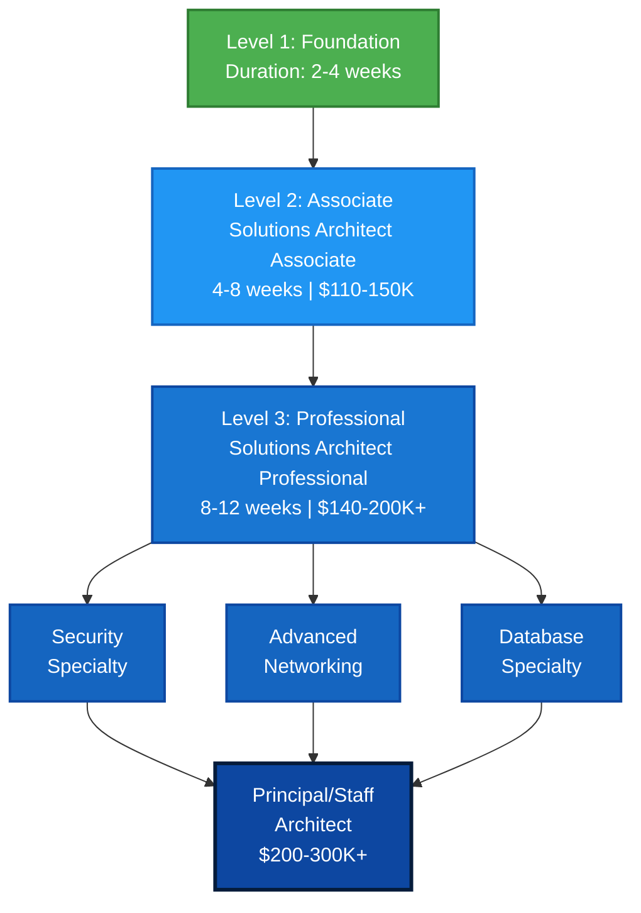
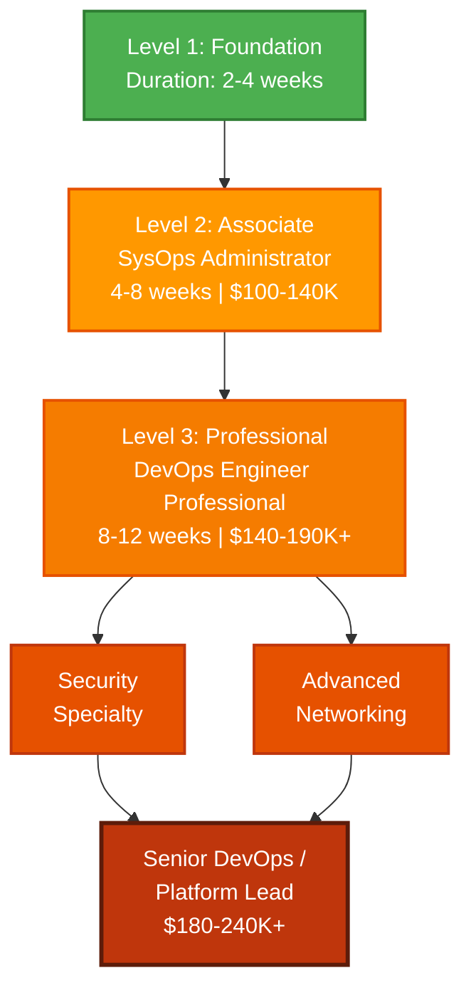
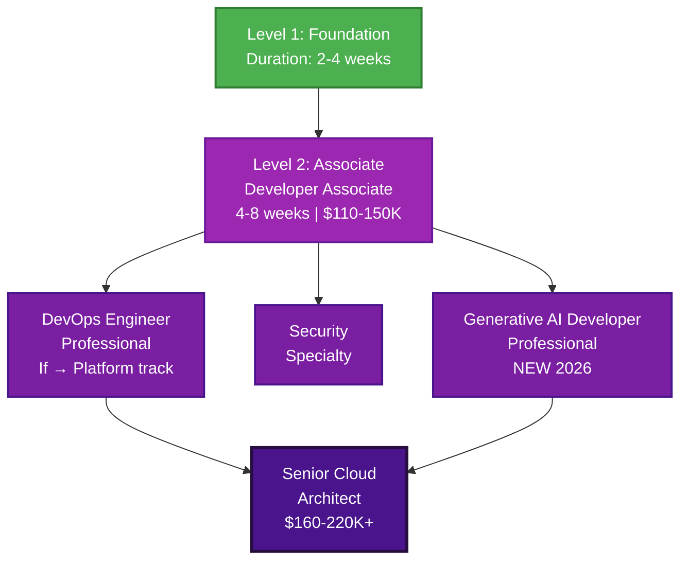
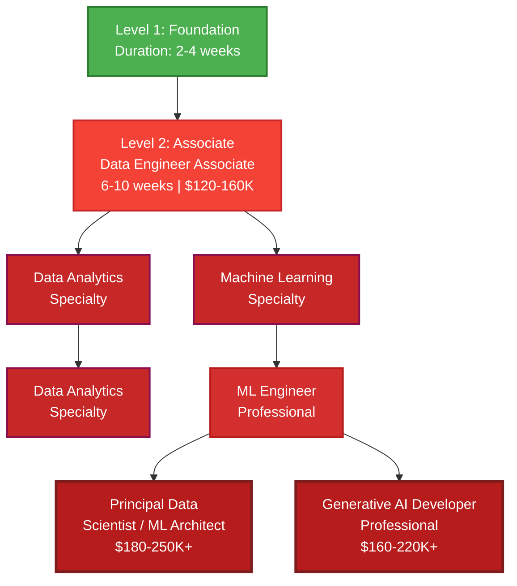
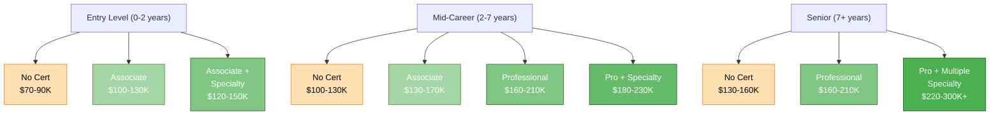
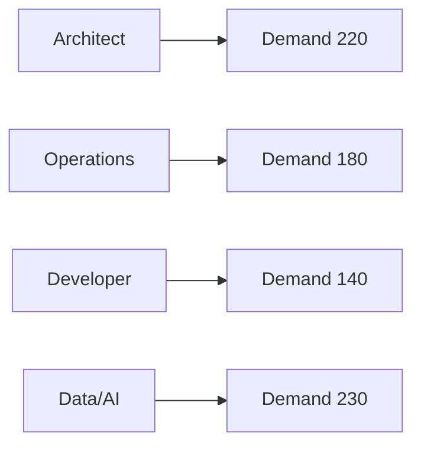
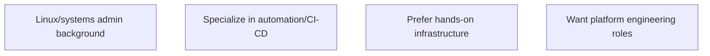
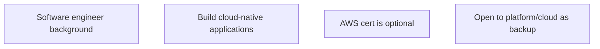
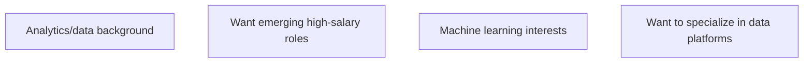

# AWS Certification Career Paths - Mermaid Edition

## 📊 Complete AWS Certification Roadmap

### Full Career Progression Tree



---

## 🎯 ARCHITECT PATHWAY

### Career Progression: Architect Track



**Best For:**
- ✅ Most job market demand (⭐⭐⭐⭐⭐)
- ✅ Transitioning from IT ops/infrastructure
- ✅ Want to reach Principal/Staff roles
- ✅ Highest salary ceiling ($200K+)

**Timeline:** 4-6 months to first role  
**ROI:** Highest (10-20% salary premium)

---

## 🔧 OPERATIONS PATHWAY

### Career Progression: DevOps/Platform Track



**Best For:**
- ✅ Linux/systems admin background
- ✅ Hands-on automation/CI-CD focus
- ✅ Platform engineering roles
- ✅ In-demand roles (⭐⭐⭐⭐)

**Timeline:** 4-8 months to first role  
**ROI:** High (10-15% salary premium)

---

## 💻 DEVELOPER PATHWAY

### Career Progression: Software Engineer Track



**Best For:**
- ✅ Software engineers
- ✅ Cloud-native app development
- ✅ Portfolio matters more than cert
- ✅ Cert is optional (⭐⭐⭐)

**Timeline:** Already employed; cert optional  
**ROI:** Low for salary (5-8% premium)

---

## 📊 DATA/AI PATHWAY

### Career Progression: Data & Machine Learning Track



**Best For:**
- ✅ Analytics/data background
- ✅ Emerging high-salary roles (⭐⭐⭐⭐⭐)
- ✅ Machine learning interests
- ✅ Fastest growing domain

**Timeline:** 3-6 months to first role  
**ROI:** Highest (15-25% salary premium, fastest growth)

---

## ⏱️ Timeline Comparison

### Fast-Track vs Standard vs Gradual

```mermaid
gantt
    title AWS Certification Timeline Comparison
    dateFormat YYYY-MM-DD
    
    section Fast-Track (6 months)
    Cloud Practitioner :ft1, 2026-01-01, 56d
    Associate Cert :ft2, after ft1, 56d
    Hands-on Projects :ft3, after ft2, 56d
    Job Search Ready :crit, ft3, 0d
    
    section Standard (9-12 months)
    Cloud Practitioner :st1, 2026-01-01, 56d
    Associate Cert :st2, after st1, 112d
    Hands-on Projects :st3, after st2, 112d
    Professional/Specialty :st4, after st3, 56d
    Job Search Ready :crit, after st4, 0d
    
    section Gradual (12-18 months)
    Cloud Practitioner (weekends) :gt1, 2026-01-01, 112d
    Associate Cert (10h/week) :gt2, after gt1, 168d
    Hands-on Work & Projects :gt3, after gt2, 168d
    Professional Cert (10h/week) :gt4, after gt3, 112d
    Job Search :gt5, after gt4, 56d
```

---

## 💰 Salary Impact Comparison

### By Certification Level & Career Stage



---

## 🎯 Job Market Demand by Path



---

## 📋 Certification Details by Role Path

### ARCHITECT PATHWAY

**Level 1: FOUNDATIONAL**
- Cloud Practitioner
  - Duration: 2-4 weeks
  - Prerequisites: None
  - Prep Cost: $15

**Level 2: ASSOCIATE** ⭐ ENTRY LEVEL
- Solutions Architect Associate
  - Duration: 4-8 weeks
  - Prerequisites: Cloud Practitioner (recommended)
  - Prep Cost: $30
  - Salary Range: **$110-150K**
  - Job Market: **⭐⭐⭐⭐⭐ HIGHLY IN-DEMAND**

**Level 3: PROFESSIONAL** ⭐⭐ ADVANCEMENT
- Solutions Architect Professional
  - Duration: 8-12 weeks (after Associate)
  - Prerequisites: Solutions Architect Associate
  - Prep Cost: $50
  - Salary Range: **$140-200K+**
  - Job Market: **⭐⭐⭐⭐⭐ HIGHLY IN-DEMAND**

**Level 4: SPECIALTY** (Choose 1-3)
- Security Specialty: +$10-20K salary impact
- Advanced Networking Specialty: +$10-20K salary impact
- Database Specialty: +$10-20K salary impact

---

### OPERATIONS PATHWAY

**Level 1: FOUNDATIONAL**
- Cloud Practitioner
  - Duration: 2-4 weeks

**Level 2: ASSOCIATE** ⭐ ENTRY LEVEL
- SysOps Administrator Associate
  - Duration: 4-8 weeks
  - Prep Cost: $30
  - Salary Range: **$100-140K**
  - Job Market: **⭐⭐⭐⭐ IN-DEMAND**

**Level 3: PROFESSIONAL** ⭐⭐ ADVANCEMENT
- DevOps Engineer Professional
  - Duration: 8-12 weeks
  - Prerequisites: SysOps Associate (recommended)
  - Prep Cost: $50
  - Salary Range: **$140-190K+**
  - Job Market: **⭐⭐⭐⭐ IN-DEMAND**

**Level 4: SPECIALTY** (Choose 1-2)
- Security Specialty: +$8-15K
- Advanced Networking Specialty: +$8-15K

---

### DEVELOPER PATHWAY

**Level 1: FOUNDATIONAL**
- Cloud Practitioner
  - Duration: 2-4 weeks

**Level 2: ASSOCIATE** ⭐ ENTRY LEVEL
- Developer Associate
  - Duration: 4-8 weeks
  - Prep Cost: $30
  - Salary Range: **$110-150K**
  - Job Market: **⭐⭐⭐ MODERATE** (cert optional)

**Level 3: PROFESSIONAL/SPECIALTY**
- DevOps Engineer Professional (if moving to platform)
  - Salary Impact: +$15-25K
- Security Specialty
  - Salary Impact: +$5-10K
- **Generative AI Developer Professional** (NEW 2026)
  - Salary Impact: +$20-30K

---

### DATA/AI PATHWAY

**Level 1: FOUNDATIONAL**
- Cloud Practitioner
  - Duration: 2-4 weeks

**Level 2: ASSOCIATE** ⭐ ENTRY LEVEL
- Data Engineer Associate
  - Duration: 6-10 weeks
  - Prep Cost: $30
  - Salary Range: **$120-160K**
  - Job Market: **⭐⭐⭐⭐⭐ HIGH DEMAND**

**Level 3: SPECIALTY**
- Data Analytics Specialty
  - Duration: 4-8 weeks
  - Salary Impact: +$10-15K
- Machine Learning Specialty
  - Duration: 6-10 weeks
  - Salary Impact: +$15-25K

**Level 3+: PROFESSIONAL**
- Machine Learning Engineer Professional
  - Duration: 10-14 weeks
  - Salary Range: **$150-200K+**
- Generative AI Developer Professional
  - Duration: 8-12 weeks
  - Salary Range: **$160-220K+** (premium for AI expertise)

---

## 🎯 Career Path Decision Matrix

### Choose ARCHITECT if:
```mermaid
flowchart TD
  A[Most job market demand]
  B[Transitioning from IT ops/infrastructure]
  C[Want Principal/Staff roles]
  D[Need highest salary ceiling ($200K+)]
```
- **Timeline:** 4-6 months to first role
- **ROI:** Highest (10-20% premium)

### Choose OPERATIONS if:

- **Timeline:** 4-8 months to first role
- **ROI:** High (10-15% premium)

### Choose DEVELOPER if:

- **Timeline:** Already employed; cert optional
- **ROI:** Low (5-8% premium)

### Choose DATA/AI if:

- **Timeline:** 3-6 months to first role
- **ROI:** Highest (15-25% premium, fastest growing)

---

## 📌 Key Takeaways

1. **Start with Cloud Practitioner** - Universal foundation
2. **Choose ONE Associate cert** - Based on career goal
3. **Get hands-on** - Labs and projects matter as much as exams
4. **Specialize later** - Professional or Specialty certs after proving experience
5. **Regional opportunity** - Architect and Data Engineer roles have highest demand in tech hubs
6. **Cert stacking** - SA Professional + Security Specialty = maximum marketability
7. **Timeline realism** - Don't rush; 3-4 months per cert is sustainable

---

## 🚀 Recommended 2026 Career Paths

### For Maximum Job Market Demand
1. Cloud Practitioner (foundation)
2. Solutions Architect Associate (primary)
3. DevOps Engineer Professional (or stay with SA Professional)
4. Security Specialty (add credibility)

**Salary Potential:** $140-220K  
**Time Investment:** 12-16 weeks  
**Job Market:** ⭐⭐⭐⭐⭐

---

### For Fastest Career Transition
1. Cloud Practitioner (foundation)
2. SysOps Administrator Associate (if from ops background)
3. DevOps Engineer Professional (advancement)
4. Solutions Architect Associate (broaden marketability)

**Salary Potential:** $120-180K  
**Time Investment:** 12-16 weeks  
**Job Market:** ⭐⭐⭐⭐

---

### For Emerging High-Salary Track
1. Cloud Practitioner (foundation)
2. Data Engineer Associate (primary)
3. Machine Learning Specialty (depth)
4. Machine Learning Engineer Professional (advancement)

**Salary Potential:** $150-220K  
**Time Investment:** 16-24 weeks  
**Job Market:** ⭐⭐⭐⭐⭐ (fastest growing)

---

### For Principal/Staff Architect Goal
1. Cloud Practitioner
2. Solutions Architect Associate (primary)
3. Solutions Architect Professional (advancement)
4. Security Specialty + Advanced Networking Specialty (depth)
5. Consider: DevOps Professional (platform credibility)

**Salary Potential:** $180-300K+  
**Time Investment:** 24-32 weeks  
**Job Market:** ⭐⭐⭐⭐ (limited slots, high competition)

---

*Last Updated: June 16, 2026*
